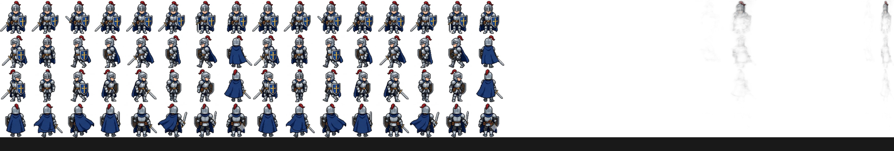
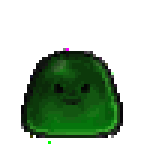

<p align="center">
  
  
  
  
  
</p>

<h1 align="center">FrameRonin MCP</h1>

<p align="center">
  <strong>22 MCP tools. One server. Complete pixel art game asset pipeline for AI.</strong><br>
  AI generates → AI processes → Game-ready assets. All through a single MCP connection.
</p>

<p align="center">
  English | <a href="README.zh.md">中文</a>
</p>

---

## Overview

FrameRonin MCP wraps the [FrameRonin](https://github.com/systemchester/FrameRonin) pixel art toolset into an MCP (Model Context Protocol) server. AI assistants can directly generate sprites via multiple backends, remove backgrounds, compose sprite sheets, convert GIFs, pixelate images, and extract video frames — all through tool calls.

> **Original project**: [systemchester/FrameRonin](https://github.com/systemchester/FrameRonin) — a full-stack web application with UI for pixel art processing. This MCP server extracts the core algorithms and adds AI-powered generation, making them callable by Claude, Gemini CLI, Copilot, and other MCP-compatible AI tools.

### What Can AI Do With This?

```
"Generate a pixel art fire mage sprite sheet and prepare it for RPG Maker"
  → generate_rpgmaker("fire mage, red robes", rows=4, cols=4, width=48, height=48)
  → 16 frame PNGs, transparent background, no watermark, ready to import

"Remove the green screen from this actor photo"
  → image_chroma_key("actor_green_screen.png", key_color="green", tolerance=40)

"Convert this video of a walk cycle into a sprite sheet"
  → video_to_spritesheet("walk_cycle.mp4", fps=12, columns=4)

"Turn this high-res artwork back into pixel art"
  → image_pixelate("artwork.png", num_colors=16, scale_result=4)
```

### Screenshots

Gemini generates a sprite sheet (4×4 grid). FrameRonin processes it into usable game assets:

<p align="center">
  
</p>

**Each row is an animation direction, each column is a frame of that animation:**

<p align="center">
    
    
  
  <br><sub>Warrior walk · Sword glow · Slime bounce — 4-frame loops extracted from sprite sheet</sub>
</p>

| Step | Tool | Input → Output |
|---|---|---|
| 1. Generate | `generate_gemini` | Prompt → sprite sheet |
| 2. Clean | `image_remove_gemini_watermark` | Remove AI watermark |
| 3. Matte | `image_remove_background` | White bg → transparent |
| 4. Resize | `image_resize` | Scale to target grid (e.g. 192×192 for 4×48px) |
| 5. Split | `spritesheet_split` | Sheet → 16 individual frame PNGs |

**Final output**: 16 PNGs (48×48 each with transparent background) — directly importable into RPG Maker MV, Godot, Unity, or any 2D game engine.

---

## Install

```bash
pip install frame-ronin-mcp
```

> Requires Python 3.11+, FFmpeg (for video tools), Chrome (for Gemini web generation).

## Configure

Add to your MCP client config (e.g. `.claude/mcp.json` for Claude Code):

```json
{
  "mcpServers": {
    "frame-ronin": {
      "command": "frame-ronin-mcp"
    }
  }
}
```

No environment variables needed for free Gemini generation or any post-processing tools.

## Tools (22)

### Generation — 6 tools

Five independent backends + one unified pipeline. Each backend is a self-contained module — add new ones by dropping a `.py` file.

| Tool | Backend | Auth | Best for |
|---|---|---|---|
| `generate_gemini` | [Gemini](https://gemini.google.com) free web app | Google login (once) | Free, no setup |
| `generate_dalle` | [OpenAI DALL-E 3](https://platform.openai.com) | `OPENAI_API_KEY` | Natural language, diverse styles |
| `generate_stability` | [Stability AI](https://platform.stability.ai) | `STABILITY_API_KEY` | Pixel art control, fine-tuning |
| `generate_gemini_api` | [Gemini API](https://aistudio.google.com) | `GOOGLE_API_KEY` + billing | Fastest, programmatic |
| `generate_siliconflow` | [SiliconFlow](https://cloud.siliconflow.cn) | `SILICONFLOW_API_KEY` | Qwen/FLUX models, Chinese prompts |
| `generate_rpgmaker` | Any backend → full pipeline | per backend | One-call: gen → clean → matte → split |

> **`generate_rpgmaker` pipeline**: generate → remove Gemini watermark → AI background removal (rembg/U2Net) → resize to RPG Maker grid → split into individual frame PNGs. All in one call.

### Processing — 16 tools

| Category | Tool | Description |
|---|---|---|
| **Video** | `video_to_spritesheet` | Extract frames → rembg matting → sprite sheet + index JSON |
| | `video_get_info` | Probe video: duration, resolution, fps, frame count |
| | `video_remove_watermark` | Remove Seedance/Jiemeng watermark (crop bottom 180px) |
| **Matting** | `image_remove_background` | AI matting via rembg/U2Net |
| | `image_chroma_key` | Green/blue screen removal + spill suppression + edge erosion |
| | `image_double_background_matte` | Black+white differential alpha extraction |
| **Image** | `image_remove_gemini_watermark` | Reverse alpha blending with embedded 48/96px mask |
| | `image_resize` | Scale (lanczos/nearest/bilinear/bicubic) |
| | `image_crop` | Crop to rectangle |
| | `image_merge_grid` | Merge images into grid atlas |
| **GIF/Sprite** | `gif_extract_frames` | Extract frames from animated GIF |
| | `frames_to_gif` | Combine frames into GIF |
| | `spritesheet_split` | Split spritesheet by uniform grid |
| | `spritesheet_compose` | Compose frames into spritesheet + index |
| **Pixel Art** | `image_pixelate` | Proper pixel art: OpenCV mesh detection → downsample |
| | `image_pixelate_simple` | Simple uniform-grid pixelation (fast) |

---

## Project Structure

```
FrameRonin-MCP/
├── frame_ronin_mcp/
│   ├── server.py               # MCP server entry point
│   ├── tools/
│   │   ├── generate/           # Multi-backend image generation
│   │   │   ├── gemini_web.py   #   Gemini free web app (Playwright)
│   │   │   ├── gemini_api.py   #   Gemini API (google-genai)
│   │   │   ├── dalle.py        #   OpenAI DALL-E 3
│   │   │   ├── stability.py    #   Stability AI
│   │   │   └── siliconflow.py  #   SiliconFlow (Qwen/FLUX)
│   │   ├── video.py            # FFmpeg + rembg pipeline
│   │   ├── matting.py          # AI/chroma/double-bg matting
│   │   ├── image.py            # Resize, crop, watermark removal
│   │   ├── gif_sprite.py       # GIF extraction, sprite sheet ops
│   │   └── pixelate.py         # Proper pixel art conversion
│   └── lib/                    # Core algorithms (pure Python)
│       ├── watermark.py        # Gemini watermark removal
│       ├── chroma_key.py       # Chroma key matting
│       ├── double_bg.py        # Double background matting
│       ├── mesh.py             # OpenCV grid detection
│       └── pixelate_core.py    # Proper pixel art algorithm
├── pyproject.toml
└── README.md
```

---

## Related

- [FrameRonin](https://github.com/systemchester/FrameRonin) — original web application with full UI
- [proper-pixel-art](https://github.com/KennethJAllen/proper-pixel-art) — pixel art downsampling algorithm
- [GeminiWatermarkTool](https://github.com/allenk/GeminiWatermarkTool) — watermark removal technique

## License

MIT © [FrameRonin](https://github.com/systemchester/FrameRonin)
