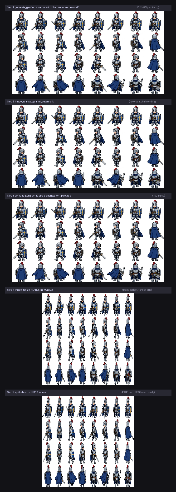

<p align="center">
  
  
  
  
  
</p>

<h1 align="center">FrameRonin MCP</h1>

<p align="center">
  <strong>22个MCP工具。一个Server。完整的像素游戏素材AI管线。</strong><br>
  AI生成 → AI处理 → 游戏可用素材。全都通过一个MCP连接完成。
</p>

<p align="center">
  <a href="README.md">English</a> | 中文
</p>

---

## 概述

FrameRonin MCP 将 [FrameRonin](https://github.com/systemchester/FrameRonin) 像素画工具集封装为 MCP (Model Context Protocol) Server。AI助手可以直接通过工具调用：多后端生成精灵图、去背景、合成精灵表、转换GIF、像素化图片、提取视频帧。

> **原项目**: [systemchester/FrameRonin](https://github.com/systemchester/FrameRonin) — 带UI的全栈像素处理Web应用。本MCP Server提取了核心算法并加入了AI生成能力，让Claude、Gemini CLI、Copilot等MCP兼容的AI工具可以直接调用。

### AI能做什么？

```
"帮我生成一个像素风火法角色，做成RPG Maker格式"
  → generate_rpgmaker("火焰法师，红色法袍", rows=4, cols=4, width=48, height=48)
  → 16帧PNG，透明背景，无水印，可直接导入引擎

"把这张绿幕照片去背景"
  → image_chroma_key("actor_green_screen.png", key_color="green", tolerance=40)

"把这个走路视频转成精灵表"
  → video_to_spritesheet("walk_cycle.mp4", fps=12, columns=4)

"这张高清图转回像素风"
  → image_pixelate("artwork.png", num_colors=16, scale_result=4)
```

### 提示词自动扩写

所有 `generate_*` 工具会自动将简短提示词扩写为2000+字的专业像素画规格——包含色板规范、抗锯齿禁令、抖动模式、精灵表布局约定和RPG Maker格式要求。只需用大白话描述角色/物品/怪物，框架自动补全技术细节。

### 演示 — 完整管线

输入: *"一个穿银盔甲拿剑的战士"* — 自动扩写后，经过全部5步处理：

<p align="center">
  
</p>

**每行是一个动画方向，每列是该方向的一帧：**

<p align="center">
    
    
  
  <br><sub>战士行走 · 剑发光 · 史莱姆弹跳 — 从精灵表拆出的4帧循环动画</sub>
</p>

| 步骤 | 工具 | 效果 |
|---|---|---|
| 1. 生成 | `generate_gemini` | 自动扩写提示词 → 1024×559精灵表 |
| 2. 清洁 | `image_remove_gemini_watermark` | 反向Alpha混合去除AI水印 |
| 3. 抠图 | `image_remove_background` | 白底 → 透明背景 (rembg/U2Net) |
| 4. 缩放 | `image_resize` | 缩放到192×192 (4×48px RPG Maker网格) |
| 5. 拆帧 | `spritesheet_split` | 精灵表 → 16个48×48独立帧PNG |

**最终产出**: 16张48×48透明背景PNG — 可直接导入RPG Maker MV、Godot、Unity等引擎使用。

---

## 安装

```bash
pip install frame-ronin-mcp
```

> 需要 Python 3.11+、FFmpeg（视频工具）、Chrome（Gemini网页生成）。

## 配置

在MCP客户端配置中添加（如Claude Code的 `.claude/mcp.json`）：

```json
{
  "mcpServers": {
    "frame-ronin": {
      "command": "frame-ronin-mcp"
    }
  }
}
```

免费Gemini网页生成和所有后处理工具不需要任何环境变量。

## 工具列表（22个）

### 生成 — 6个

五种独立后端 + 一个统一管线。每个后端是独立模块，新增后端只需新增一个 `.py` 文件。

| 工具 | 后端 | 认证 | 最适合 |
|---|---|---|---|
| `generate_gemini` | [Gemini](https://gemini.google.com) 免费网页版 | Google登录（一次） | 免费，零配置 |
| `generate_dalle` | [OpenAI DALL-E 3](https://platform.openai.com) | `OPENAI_API_KEY` | 自然语言理解，风格多样 |
| `generate_stability` | [Stability AI](https://platform.stability.ai) | `STABILITY_API_KEY` | 像素风精细控制 |
| `generate_gemini_api` | [Gemini API](https://aistudio.google.com) | `GOOGLE_API_KEY` + 付费 | 最快，纯程序化 |
| `generate_siliconflow` | [SiliconFlow](https://cloud.siliconflow.cn) | `SILICONFLOW_API_KEY` | Qwen/FLUX模型，支持中文prompt |
| `generate_rpgmaker` | **任意后端** → 完整管线 | 按后端 | 一键：生成→去水印→抠图→缩放→拆帧 |

> **`generate_rpgmaker` 管线**: 生成 → 去Gemini水印 → AI去背景(rembg/U2Net) → 缩放到RPG Maker网格 → 拆分为独立帧PNG。一次调用搞定全部。

### 处理 — 16个

| 类别 | 工具 | 说明 |
|---|---|---|
| **视频** | `video_to_spritesheet` | 拆帧 → rembg抠图 → 精灵表 + 索引JSON |
| | `video_get_info` | 探针：时长、分辨率、帧率、总帧数 |
| | `video_remove_watermark` | 去Seedance/即梦水印（裁切底部180px） |
| **抠图** | `image_remove_background` | AI抠图 (rembg/U2Net) |
| | `image_chroma_key` | 绿幕/蓝幕抠图 + 溢色抑制 + 边缘侵蚀 |
| | `image_double_background_matte` | 黑底+白底差分提取Alpha |
| **图片** | `image_remove_gemini_watermark` | 反向Alpha混合去水印（内嵌48/96px mask） |
| | `image_resize` | 缩放 (lanczos/nearest/bilinear/bicubic) |
| | `image_crop` | 矩形裁切 |
| | `image_merge_grid` | 多图拼成网格图集 |
| **GIF/精灵表** | `gif_extract_frames` | GIF拆帧为PNG序列 |
| | `frames_to_gif` | PNG序列合成GIF动图 |
| | `spritesheet_split` | 精灵表网格拆分为单帧 |
| | `spritesheet_compose` | 单帧合成精灵表 + 索引元数据 |
| **像素化** | `image_pixelate` | 像素化: OpenCV网格检测 → 逐格下采样 |
| | `image_pixelate_simple` | 简单均匀网格像素化（快速） |

---

## 项目结构

```
FrameRonin-MCP/
├── frame_ronin_mcp/
│   ├── server.py               # MCP服务入口
│   ├── tools/
│   │   ├── generate/           # 多后端图片生成
│   │   │   ├── gemini_web.py   #   Gemini免费网页版 (Playwright)
│   │   │   ├── gemini_api.py   #   Gemini API (google-genai)
│   │   │   ├── dalle.py        #   OpenAI DALL-E 3
│   │   │   ├── stability.py    #   Stability AI
│   │   │   └── siliconflow.py  #   SiliconFlow (Qwen/FLUX)
│   │   ├── video.py            # FFmpeg + rembg 管线
│   │   ├── matting.py          # AI/色度键/双背景抠图
│   │   ├── image.py            # 缩放、裁切、去水印
│   │   ├── gif_sprite.py       # GIF拆帧、精灵表操作
│   │   └── pixelate.py         # 像素化
│   └── lib/                    # 核心算法（纯Python）
│       ├── watermark.py        # Gemini水印去除
│       ├── chroma_key.py       # 色度键抠图
│       ├── double_bg.py        # 双背景抠图
│       ├── mesh.py             # OpenCV网格检测
│       └── pixelate_core.py    # proper-pixel-art 算法
├── pyproject.toml
├── README.md
└── README.zh.md
```

## 相关链接

- [FrameRonin](https://github.com/systemchester/FrameRonin) — 原项目（带完整UI的Web应用）
- [proper-pixel-art](https://github.com/KennethJAllen/proper-pixel-art) — 像素画下采样算法
- [GeminiWatermarkTool](https://github.com/allenk/GeminiWatermarkTool) — 水印去除技术

## 许可证

MIT © [FrameRonin](https://github.com/systemchester/FrameRonin)
